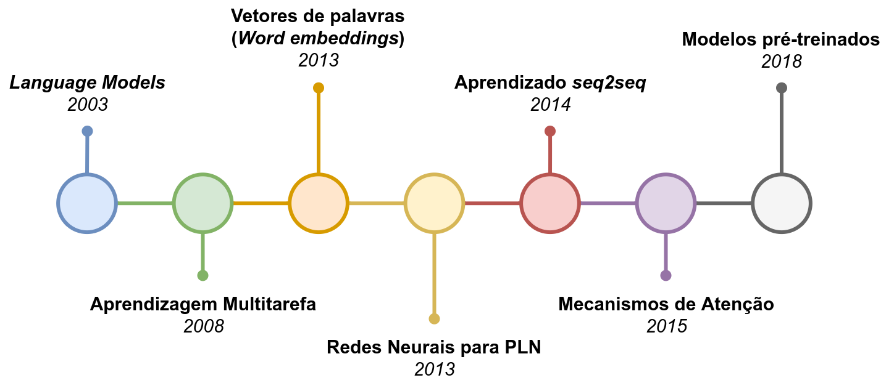
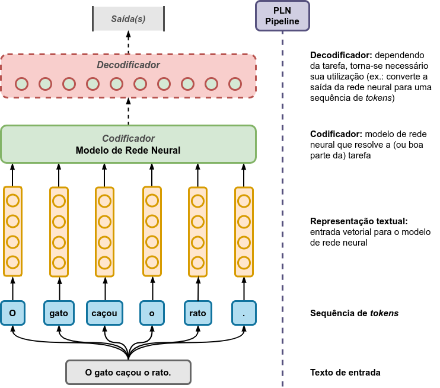

# [CSBC JAI 2022](https://csbc.sbc.org.br/2022/jai/): Processamento de Linguagem Natural via Aprendizagem Profunda

<p align="center">
  
</p>

---

## Abstract

*In recent years, a large amount of textual data has been generated on and off the Web. Users are often unable to extract value from all this amount of information available in different sources and formats. This chapter presents how Deep Learning techniques can solve Natural Language Processing (NLP) tasks (e.g., Text Classification and Summarization), aiming to benefit from the computational power currently available and the low need for feature engineering when using these models. Initially, some essential concepts about NLP and Deep Learning are presented. Then, different pre-processing and textual representation techniques are explained to be used as input in Deep Learning models. Finally, it is shown how to apply the knowledge acquired in real applications of NLP.*

## Resumo

Nos últimos anos, uma grande quantidade de dados textuais está sendo gerada a todo instante dentro e fora da *Web*. Muitas vezes, usuários não conseguem extrair valor de toda essa quantidade de informação disponível em diversas fontes e formatos. Este capítulo apresenta como técnicas de Aprendizagem Profunda podem ser utilizadas na resolução de tarefas de Processamento de Linguagem Natural (PLN), como Classificação e Sumarização de Textos, visando o benefício do poder computacional disponível atualmente e da baixa necessidade de engenharia de *features* na utilização destes modelos. Inicialmente, são apresentados alguns conceitos importantes sobre PLN e Aprendizagem Profunda. Em seguida, diferentes técnicas de pré-processamento e representação textuais são explicadas a fim de serem usadas como entrada em modelos de Aprendizagem Profunda. Por fim, é mostrado como aplicar os conhecimentos adquiridos em aplicações reais do PLN.

## Visão Geral

<p align="center">
  
</p>

## Citação

NÃO OFICIAL

```
@inproceedings{222646,
    author={Bárbara Neves and Lucas Gaspar and Luis Gustavo Coutinho do Rêgo and Ticiana Coelho da Silva and José Macedo},
    title={Processamento de Linguagem Natural via Aprendizagem Profunda},
    booktitle={CSBC 2022 - JAI 2022 ()},
    days={19-19},
    month={mar},
    year={2022},
    url={http://XXXXX/222646.pdf}
}

```

## Autores

- [Bárbara Neves](https://github.com/barbaraneves) - admin do curso, conteúdo e código
- [Gustavo Coutinho](https://github.com/gustavolgcr) - conteúdo e código
- [Lucas Peres](https://github.com/lucaspg96) - conteúdo e código
- Ticiana Linhares - conteúdo
- José Macêdo - conteúdo
